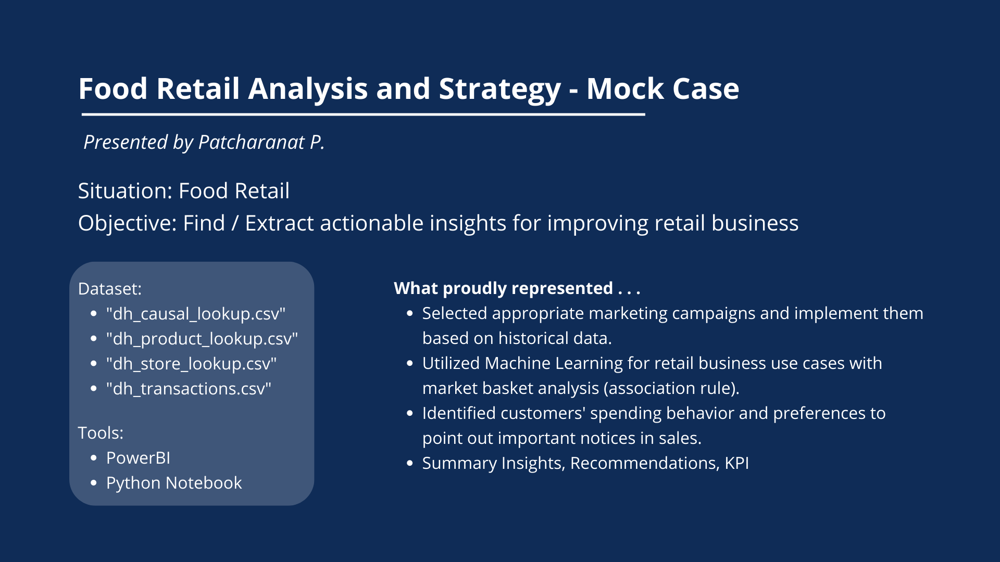
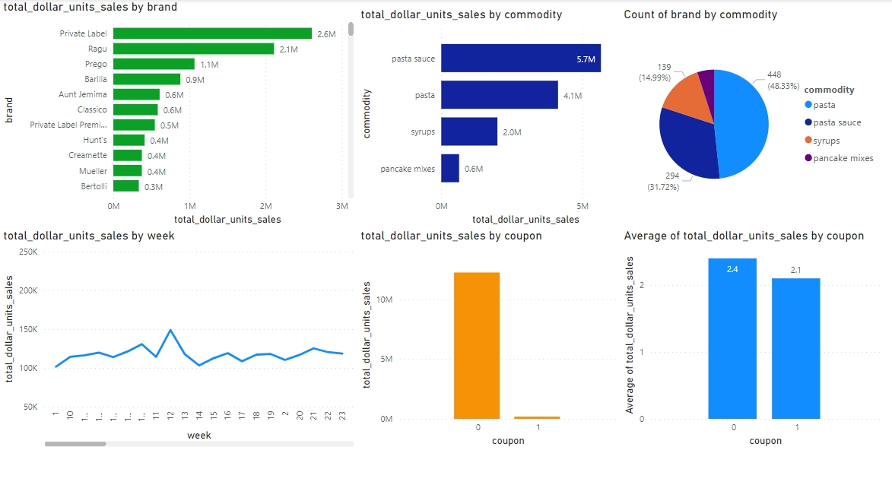
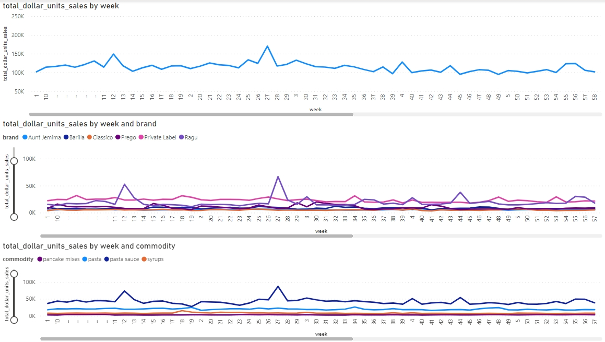
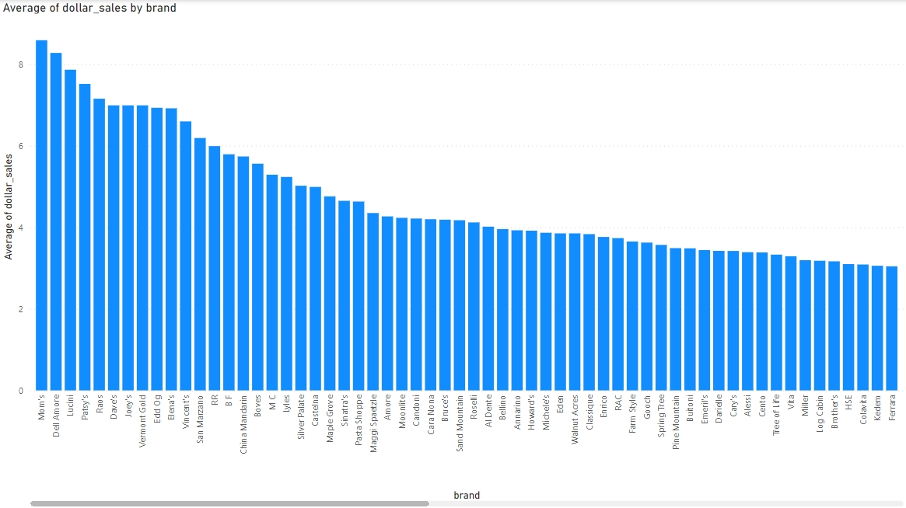
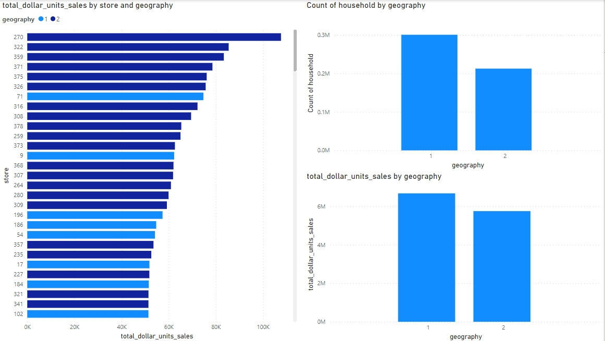
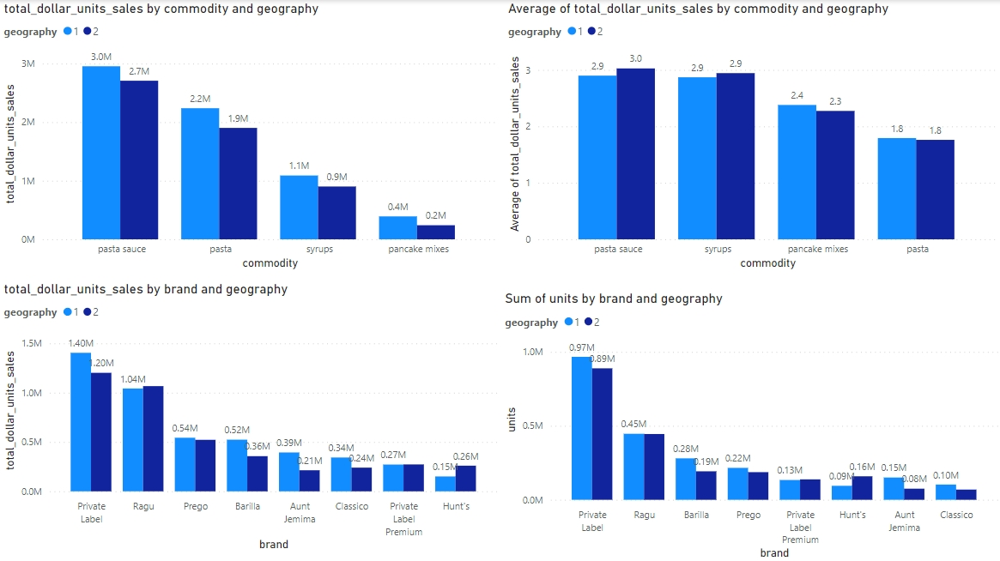

# Food Retail Analysis and Strategy - Mock Case
*By Patcharanat P.*

## Context
I was assigned to do an analysis task which involved improving retail business based on given datasets. The datasets are purhcase transactions of on-site retailer, where they put products on, and detail of each products such as its description, StockCode, and its size.

**For more detail**, please read [***food-retail-book-case.pdf***](./food-retail-book-case.pdf)

*Note: Datasets are confidential, so it's not available to download but showed the table structure in the notebook*

## Power BI - EDA
*Datasets are confidential, so .pbix file is not available*

